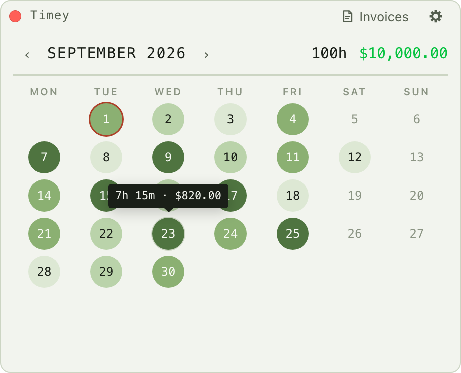
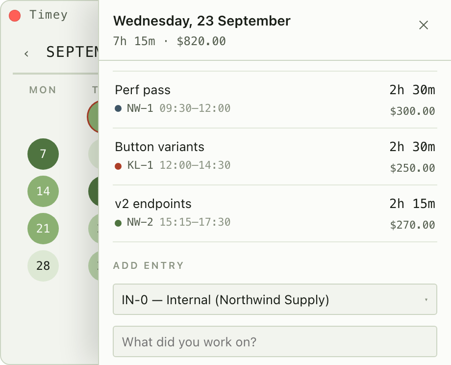

# timey

An extremely simple macOS menu bar time tracker built with [Tauri v2](https://tauri.app), React, and SQLite (data stays local).

It lives as a clock icon in the menu bar with no Dock icon and no window of its own: clicking the icon opens a popover anchored beneath it, and it dismisses when it loses focus. Right-clicking the icon gives Settings and Quit.

The month reads as a shaded grid — one circle per day, deeper the more hours worked in that day — with the month's hours and earnings in the header and a single day's figures on hover.

<picture>
  <source media="(prefers-color-scheme: dark)" srcset="docs/screenshots/tooltip-dark.png">
  
</picture>

Time is entered by hand in 15-minute increments — there is no running timer. Clicking a day opens its entries beside the grid, each with its project and what it earned, and the form to add another underneath.

<picture>
  <source media="(prefers-color-scheme: dark)" srcset="docs/screenshots/day-dark.png">
  
</picture>

## Data Structure
Data is organized as follows:

- Clients
  - Contacts: names and emails that should receive invoices
  - Projects
    - Time entries
   
## Invoices
The app can generate simple PDF invoices that include the aggregate hours for a client. If Apple mail is installed, it can open it with a simple email and pre-filled contacts for the client.

