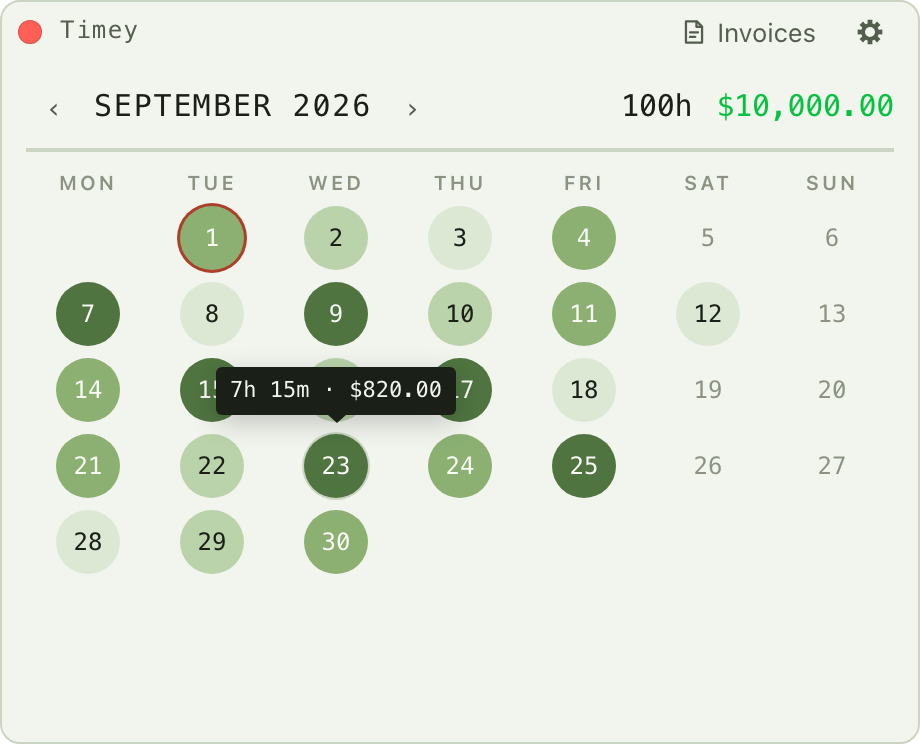
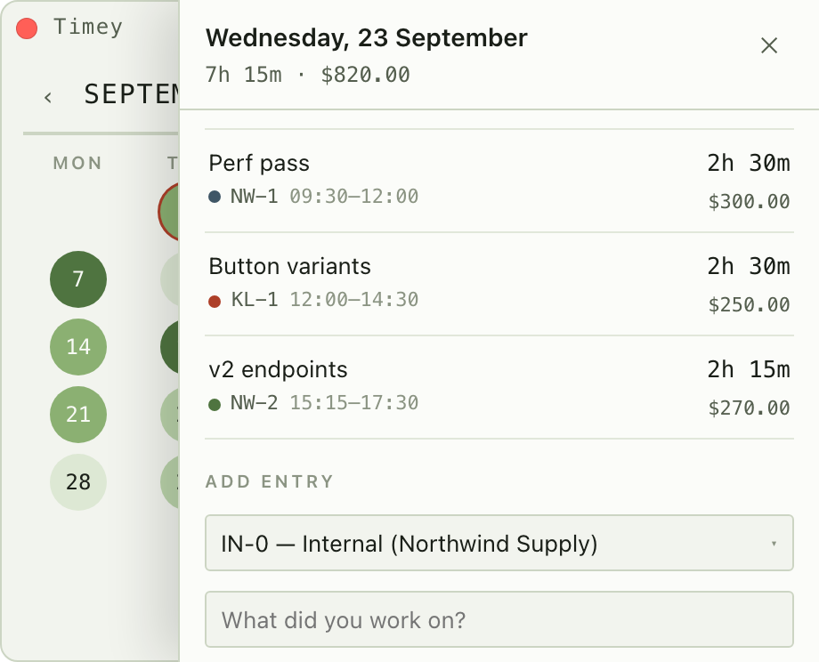

# timey

An extremely simple macOS menu bar time tracker built with [Tauri v2](https://tauri.app), React, and SQLite (data stays local).

[**Download the latest release**](https://github.com/nicoten/timey/releases/latest) — v1.5.0, a `.dmg` for Apple silicon Macs.

It lives in the menu bar as the grid of dots from its app icon, with no Dock icon and no window of its own: clicking the icon opens a popover anchored beneath it, and it dismisses when it loses focus. Right-clicking the icon gives Settings and Quit.

The month reads as a shaded grid — one circle per day, deeper the more hours worked in that day — with the month's hours and earnings in the header and a single day's figures on hover. A switch in the title bar shows the same month instead as a table of every entry — date, client, entry, hours and amount — or totalled per client; clicking an entry in the table opens it for editing.

<picture>
  <source media="(prefers-color-scheme: dark)" srcset="docs/screenshots/tooltip-dark.png">
  
</picture>

Time is entered by hand in 15-minute increments — there is no running timer. Work billed at an agreed amount rather than by the hour can be logged as a fixed-price entry instead: it carries a day and an amount but no time, so it adds to what was earned without adding hours, and appears on an invoice as a line of its own. Each client is billed in one currency, US dollars or euros, set when the client is added; its rates, fixed prices and invoices are all in that currency, and totals spanning clients in different currencies are shown side by side rather than added together. Clicking a day opens its entries beside the grid, each with its project and what it earned, and the form to add another underneath.

<picture>
  <source media="(prefers-color-scheme: dark)" srcset="docs/screenshots/day-dark.png">
  
</picture>

## Data Structure
Data is organized as follows:

- Clients
  - Contacts: names and emails that should receive invoices
  - Projects
    - Time entries
   
## Invoices
The app can generate simple PDF invoices that include the aggregate hours for a client. If Apple mail is installed, it can open it with a simple email and pre-filled contacts for the client.

Invoices are filed inside the chosen folder by year, quarter and client — `2026/Q3/Northwind GmbH/invoice-0012-….pdf` — using the quarter of the period billed rather than the day the invoice was issued. The month picker is grouped the same way, marks months a client has already been invoiced for, and asks before invoicing such a month again.

## Importing payments
Payments already received can be imported from a bank's spreadsheet export (`.xlsx`, such as BBVA's "Últimos movimientos"). The date, description and amount columns are found by their headings and contents, wherever the header row sits; outgoing payments are left out. Every row can be edited before it is imported, and each becomes a fixed-price entry. Payments already imported from an earlier, overlapping export are recognized and left unchecked.
